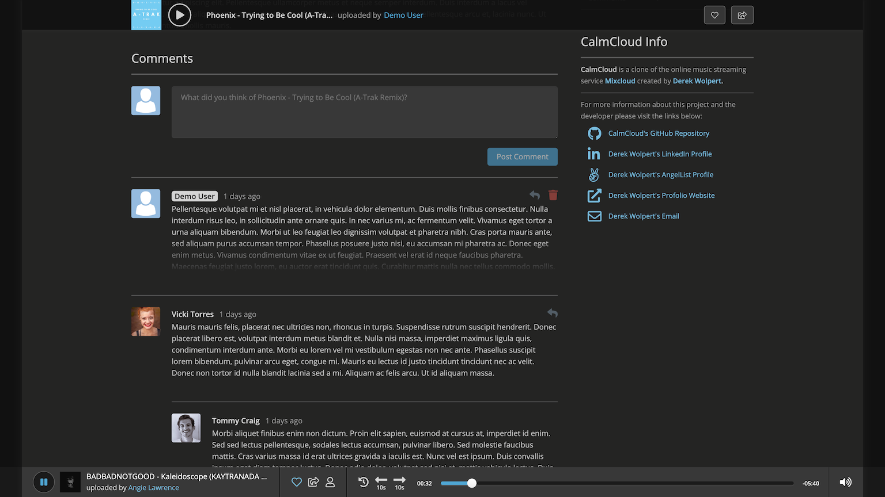

<a href="https://www.calmcloud.app/">
    
</a>

# CalmCloud

CalmCloud, a clone of Mixcloud, is an online music streaming service for music lovers - a platform where users can upload, share and interact with audio content provided by the website's wider community. Built with React, Redux, JavaScript, and Ruby on Rails, supported by a PostgreSQL database and ASW S3 storage.

#### [This project is currently hosted at CalmCloud.app - CLICK HERE to visit the live version of this project](https://www.calmcloud.app/)


## Architecture & Technologies

* `React`, a JavaScript library used to assist with efficient management of rapidly changing data and maintaining a single-page web application structure
* `Redux`, a JavaScript library used in coordination with `React` to create a centralized *store* for organizing and accessing data 
* `JavaScript`, the project's frontend programing language
* `Ruby on Rails`, a web application framework used to provide server-side structure for querying and retrieval of data from database
* `Ruby`, the project's backend programing language
* `PostgreSQL`, a database system used for storage and management of information
* `Webpack`, a JavaScript bundler to assist with development and production builds
* `CSS3` and `HTML5`, used to manage the presentation and styling of the project

<p align="middle">
    
    
</p>

## Features:

* Comprehensive **CRUD (create, read, update, delete) behavior** for **account creation**, **session management**, **audio content distribution**, **text comments**, **content favoriting** and **user subscriptions**
* Integration with **AWS S3** for efficient storage and retrieval of **user uploaded audio and image files**
* **Error handling** for character count warnings, restrictions on forbidden usernames/track titles and qualifications for valid password/email inputs
* **Continuous audio playback** across multiple webpages
* Customized presentation depending on whether or not a user is logged-in, and what content that user has interacted with (e.g. user profile and audio track pages appear slightly different if the current logged-in user is the *owner* of the content on the page)
* A **polished and intuitive user interface/experience** including progress bars, user/track statistics, loading indicators, and dynamically updating favicon indicators

## Highlighted Features

### User Authentication and Session Errors 

CalmCloud features user authentication through the usage of hashed passwords.  When a user attempts to login their inputted password is validated with the assistance of the Ruby gem ``BCrypt``. 

<p align="middle">
    
    
</p>

The code snippet below is taken from CalmCloud's ``Session Controller`` to show a portion of the login process. When a user is logging in, they can enter either a registered username or email address as a form of identification. A database query is made to find an existing account matching the user-given information. If an account is found the user will be logged-in. Otherwise an appropriate error message will be rendered. 

```
//...
def create

    @user = User.find_by_username(params[:user][:login], params[:user][:password])
    @user ||= User.find_by_email(params[:user][:login], params[:user][:password])

    if @user.nil?
        if User.find_by(username: params[:user][:login]) || User.find_by(email: params[:user][:login])
            render json: ["Incorrect password"], status: 401
        else
            if (params[:user][:login]).count("@") > 0 && (params[:user][:login]).split("@").last.count(".") > 0
                render json: ["There is no account registered with this email address. Please register."], status: 401
            else
                render json: ["Username does not exist"], status: 401
            end
        end
    else
        login!(@user)
    end

end
...//
```

### Using Waveforms as Interactive Progress Bars for Audio Playback

Throughout CalmCloud there are many indicators to show the current playback status of audio content. These include waveforms, process circles, progress bars, and even the website's own favicon. While all of these examples use different techniques to format/style their visuals, the general basis from how the playback position is accessed and maintained is the same - utilizing the ``Redux`` *store*.

<p align="middle">
    
    
</p>

Below is a code snippet for the waveform progress bars from the audio track page ``React`` component. Two translucent waveform images are overlaid on top of one another within a single HTML container. One of these images always occupies the entire width of the container. The other image is dynamically rendered to a percentage of its container's width depending on whether or not the page's content corresponds to audio actively playing.

```
//...
<div onClick={(e) => this.handleProgress(e)} className="track-show-waveform-container">

    <div className="track-show-listened-waveform" style={{ width: `${this.formatListened()}%`}} >
        <div className="track-show-listened-wrap">
            
        </div>
    </div>

    

    <span className="track-show-length">{this.formatTime(this.props.track.track_length)}</span>

</div>
...//
```
Additionally, the waveform container can be clicked on to adjust the audio's playback position. As seen in the code snippet below, this is done by converting the relative location of a *click* to a percentage, which is then sent to the ``Redux`` *store* to be accessed by other ``React`` components.
```
//...
    handleProgress(e) {
        const bounds = e.currentTarget.getBoundingClientRect();
        const percent = ((e.clientX - (bounds.left)) / bounds.width);
        this.props.currentPercent((percent * 100));
    }
...//
```

## Potential Future Features

* Allow keywords (e.g. genre) to be associated with audio tracks to assist with discovery/soring of content
* Search functionality
* Generate custom waveforms for each audio track
* User-made playlists
* Queuing of upcoming tracks
* implement *DRY*-er, more efficient code

## Additional Images

<p align="middle">
    
    
</p>
<p align="middle">
    
    
</p>

